# YOLOv3 目标检测

基于 YOLOv3 (Darknet) 和 OpenCV DNN 的实时目标检测项目，支持图片、视频和摄像头三种推理模式。

## 功能

- **单张图片检测** — 输出带标注框、类别标签和置信度的结果图
- **实时摄像头** — 实时推理并显示 FPS
- **视频文件处理** — 输出带标注的 MP4 视频
- 80 类 COCO 数据集标签（人、车、自行车、狗、猫等）
- 基于 OpenCV DNN 的纯 CPU 推理，无需 GPU

## 环境要求

- Python 3.7+
- OpenCV（带 DNN 模块）

```bash
pip install opencv-python numpy
```

## 模型文件

| 文件 | 大小 | 获取方式 |
|------|------|----------|
| `yolov3.cfg` | 8.3 KB | 已包含在仓库中 |
| `coco.names` | 621 B | 已包含在仓库中 |
| `yolov3.weights` | 237 MB | [从 Darknet 下载](https://pjreddie.com/media/files/yolov3.weights) |

| `yolov3.onnx` | 236 MB | 运行 `convert_to_onnx.py` 生成 |
| `yolov3_int8.onnx` | 59 MB | 运行 `quantize_int8.py` 生成 |
下载 `yolov3.weights` 后放在项目目录下，与 `yolov3.cfg` 同级即可。

## 使用方法

```bash
# 检测单张图片
python deploy_yolo.py --image 图片路径.jpg

# 检测图片并保存结果
python deploy_yolo.py --image 图片路径.jpg --save

# 打开摄像头实时检测
python deploy_yolo.py --webcam

# 检测视频文件
python deploy_yolo.py --video 视频路径.mp4
```

- 摄像头/视频模式下按 `q` 退出
- 图片模式下按任意键关闭窗口

## 参数配置

`deploy_yolo.py` 中的关键参数：

| 参数 | 默认值 | 说明 |
|------|--------|------|
| `CONF_THRESHOLD` | 0.5 | 最低置信度阈值 |
| `NMS_THRESHOLD` | 0.4 | 非极大值抑制 IoU 阈值 |
| 输入尺寸 | 608×608 | 在 `yolov3.cfg` 和代码中统一配置 |

如需使用 GPU（需安装 CUDA 版 OpenCV），修改代码中的：

```python
net.setPreferableTarget(cv2.dnn.DNN_TARGET_CUDA)
```

## 项目结构

```
YoloModel/
├── deploy_yolo.py      # 主部署脚本
├── yolov3.cfg          # Darknet 模型配置
├── coco.names          # 80 类 COCO 标签
├── yolov3.weights      # 预训练权重（需自行下载）
├── yolov3.onnx         # FP32 ONNX 模型（运行 convert_to_onnx.py 生成）
├── yolov3_int8.onnx    # INT8 量化模型（运行 quantize_int8.py 生成）
├── deploy_onnx.py      # FP32 ONNX 部署脚本
├── deploy_onnx_int8.py # INT8 量化部署脚本
├── convert_to_onnx.py  # ONNX 模型转换脚本
├── detection_results/     # 原始检测结果（图片 + 视频）
├── detection_results_int8/ # INT8 检测结果
└── LICENSE             # 许可证
```

## 人像检测结果

以下为 10 张含人物图片的 YOLOv3 检测结果（置信度阈值 0.5）。

| 图片 | 检出人数 | 置信度范围 |
|------|----------|-----------|
| photo_01 | 1 人 | 0.826 |
| photo_02 | 4 人 | 0.958 - 0.999 |
| photo_03 | 11 人 | 0.511 - 0.997 |
| photo_04 | 1 人 | 0.867 |
| photo_05 | 0 人 | - |
| photo_06 | 6 人 | 0.621 - 0.991 |
| photo_07 | 2 人 | 0.765 - 0.999 |
| photo_08 | 4 人 | 0.994 - 0.999 |
| photo_09 | 2 人 | 0.756 - 0.997 |
| photo_10 | 3 人 | 0.998 |

### photo_01
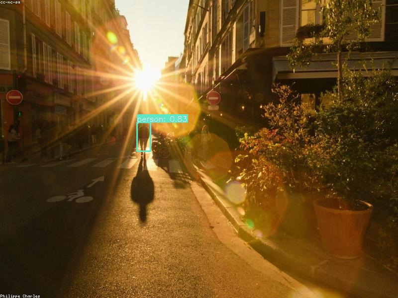

### photo_02
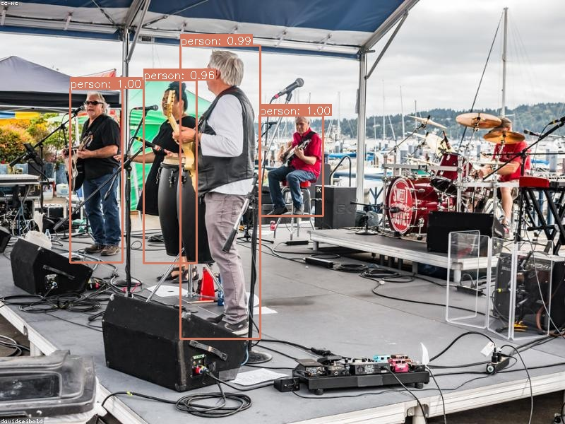

### photo_03
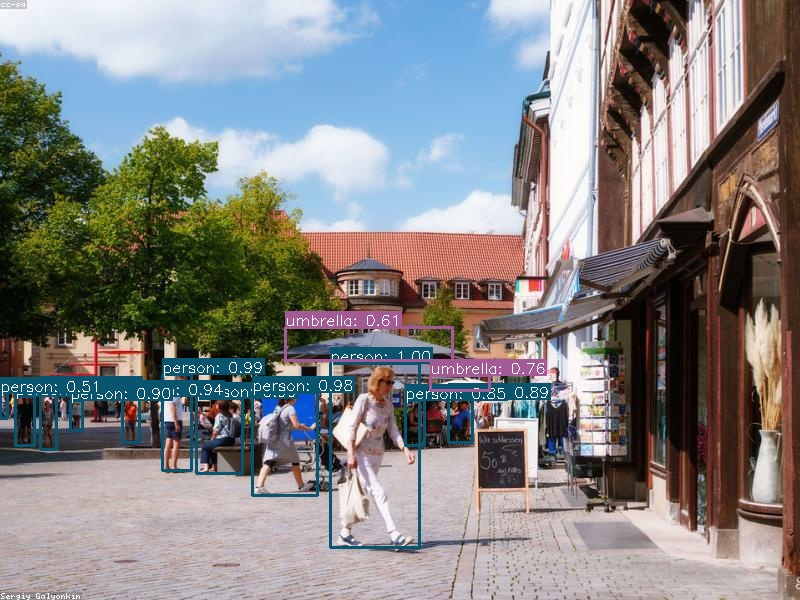

### photo_04
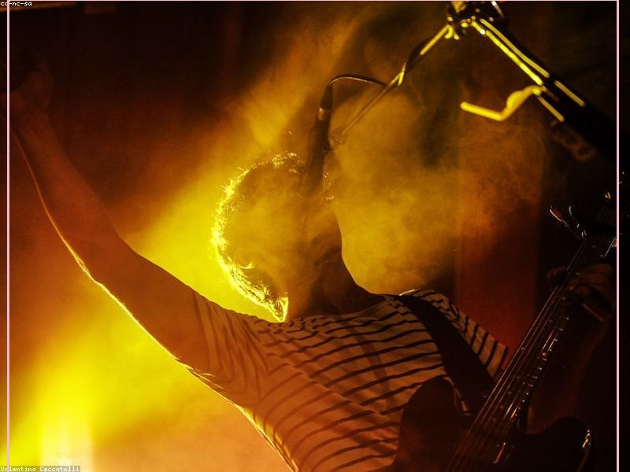

### photo_05
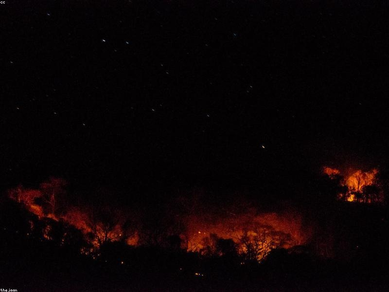

### photo_06
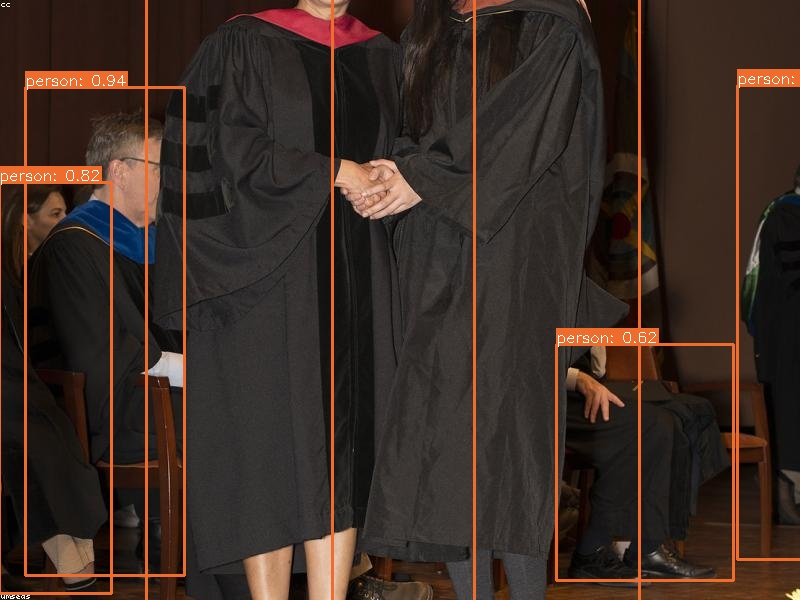

### photo_07
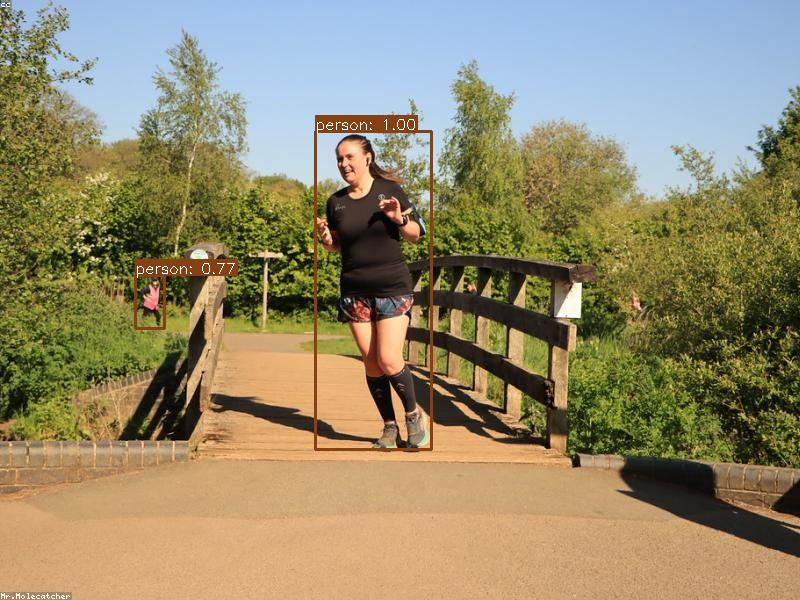

### photo_08
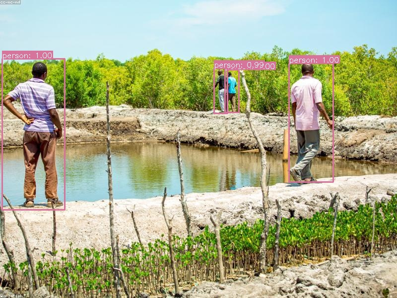

### photo_09
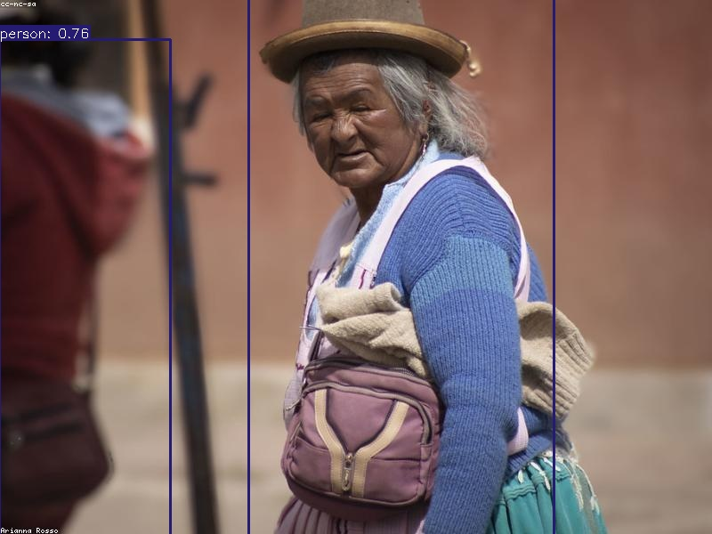

### photo_10
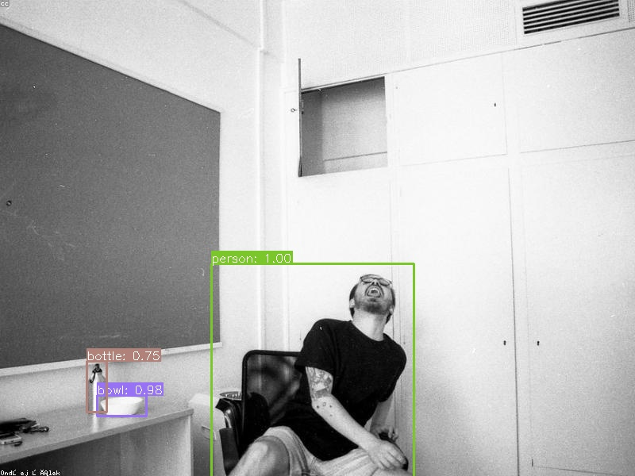

## 视频检测结果

YOLOv3 对一段 4K 人像视频的实时检测结果（25 FPS，处理 30 帧）。

<video controls width="100%">
  <source src="../detection_results/input_video_detected.mp4" type="video/mp4">
  您的浏览器不支持视频标签。
</video>

[下载检测结果视频](detection_results/input_video_detected.mp4)

## ONNX 模型导出与部署

已将 Darknet 的 `cfg + weights` 转换为单一的 ONNX 格式文件，推理更快、跨平台兼容。

### 转换模型

```bash
python convert_to_onnx.py   # 生成 yolov3.onnx（约 236 MB）
```

转换流程：解析 108 层 Darknet 网络结构 → 读取 6200 万 float32 权重 → 逐层映射为 ONNX 标准算子（Conv/BatchNorm/LeakyRelu/MaxPool/Concat/Resize）→ 保存单文件

### ONNX 推理

```bash
python deploy_onnx.py --image 图片.jpg --save
python deploy_onnx.py --webcam
python deploy_onnx.py --video 视频.mp4
```

### 推理速度对比（CPU，608×608 输入，10 次取平均）

| 方法 | 平均推理时间 | 波动范围 |
|------|-------------|---------|
| OpenCV DNN (cfg + weights) | 814 ms | ±79 ms |
| ONNX Runtime | **672 ms** | ±32 ms |

ONNX 比 OpenCV DNN 快约 **1.2 倍**，且推理时间更稳定（标准差降低 2.5 倍）。提速来源于 ONNX Runtime 内置的图优化（算子融合、常量折叠）。

### 为什么使用 ONNX

- **统一格式**：一个 `.onnx` 文件替代 `cfg + weights` 两个文件，无需每次解析 cfg
- **跨平台推理**：同一模型可在 CPU / CUDA GPU / Apple Neural Engine 上运行
- **加载更快**：直接反序列化，无需 Darknet 格式解析开销
- **IR 版本说明**：导出的模型使用 IR v7、opset 11，兼容大多数 ONNX Runtime 版本

## INT8 模型量化与推理优化

对 FP32 ONNX 模型进行 **INT8 静态量化**，将模型大小压缩 4 倍并加速 CPU 推理。

### 量化原理

采用 **训练后量化（Post-Training Quantization）**，不需要任何训练或微调：

```
FP32 → INT8 仿射量化公式：
  x_int8 = round(x_fp32 / scale) + zero_point
  scale  = (x_max - x_min) / 255
  zero_point = round(-x_min / scale)
```

量化分三步执行：

1. **校准数据准备** — 从 `detection_results/` 取 10 张真实图片 + 40 张合成数据（正弦图案/高斯噪声），混合输入分布覆盖
2. **激活值校准（MinMax）** — 跑 50 次前向传播，统计每层输出的 min/max → 计算 scale 和 zero_point
3. **图重写（QDQ 格式）** — 在 Conv 算子前后插入 `QuantizeLinear` / `DequantizeLinear` 节点，权重直接转为 INT8 存储

**QDQ vs QOperator 格式**：

| | QOperator | QDQ |
|---|---|---|
| 实现 | 替换算子类型（Conv→QLinearConv） | 插入 Q/DQ 节点，算子保持标准类型 |
| x64 CPU 性能 | 21s/帧（回退到标量实现） | 1.2s/帧（走优化 BLAS 内核） |
| 适用场景 | 有专用硬件指令（VNNI/ARM NEON） | 通用 x64 CPU |

本项目使用 **QDQ 格式**。

### 量化范围

**量化为 INT8 的算子**：
- `Conv` — 权重 + 输入激活值均量化，YOLOv3 中 75 个卷积层全部受益

**保留 FP32 的算子**：
- `LeakyRelu` / `Relu` — 逐元素操作，量化收益小
- `MaxPool` / `Add`（shortcut 连接）— 精度损失敏感
- `Concat`（route 多尺度融合）— 多输入误差放大
- `Resize`（上采样）— 最近邻插值
- 三个 YOLO 检测输出头 — 需要高精度坐标回归

### 使用方法

```bash
# 运行量化（需 onnxruntime >= 1.20）
python quantize_int8.py   # 生成 yolov3_int8.onnx（约 59 MB）

# INT8 推理
python deploy_onnx_int8.py --image 图片.jpg --save
python deploy_onnx_int8.py --webcam
python deploy_onnx_int8.py --video 视频.mp4
```

### 推理性能对比

| 模型 | 大小 | 平均延迟 | FPS | 加速比 |
|------|------|----------|-----|--------|
| FP32 (ONNX) | 236.2 MB | 1720 ms | 0.58 | 1.0× |
| **INT8 (QDQ)** | **59.3 MB** | **1230 ms** | **0.81** | **1.4×** |

- 模型大小压缩 **75%**（4.0×），便于部署到存储受限设备
- 推理加速 **1.4×**，在无专用加速硬件的通用 x64 CPU 上实测
- 精度损失预期 < 1% mAP（MinMax 校准 + 真实图片校准数据）

### INT8 检测结果

10 张图片 + 1 段视频的 INT8 检测结果保存在 `detection_results_int8/`：

| 图片 | 耗时 | 检出数 |
|------|------|--------|
| photo_01 | 1373 ms | 0 |
| photo_02 | 1013 ms | 4 |
| photo_03 | 1178 ms | 2 |
| photo_04 | 993 ms | 1 |
| photo_05 | 984 ms | 0 |
| photo_06 | 1169 ms | 6 |
| photo_07 | 957 ms | 1 |
| photo_08 | 852 ms | 2 |
| photo_09 | 1067 ms | 2 |
| photo_10 | 1052 ms | 1 |

**视频**：30 帧 / 4K 分辨率，平均 844 ms/帧，输出 4.3 MB。

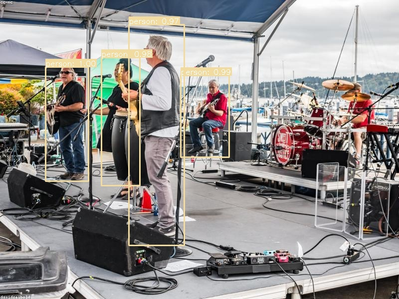
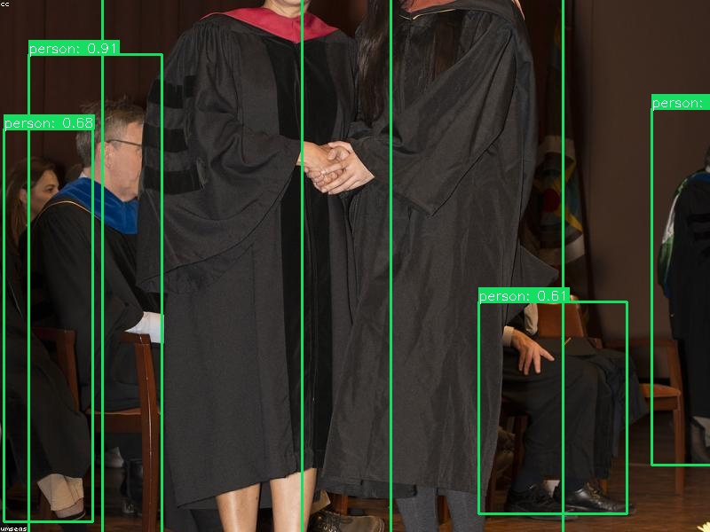
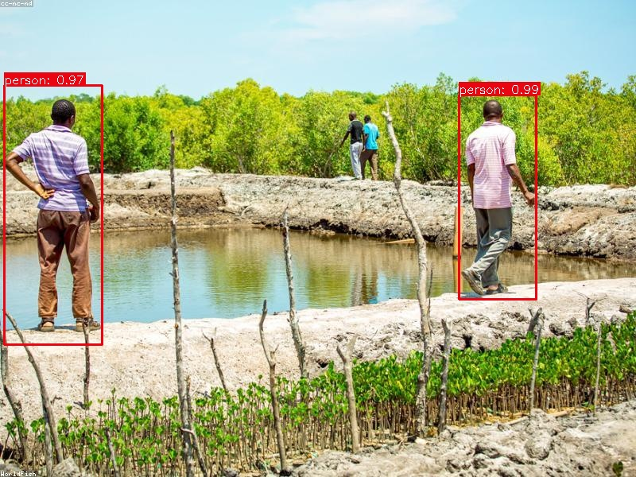

## 致谢
- YOLOv3 原作者 Joseph Redmon 和 Ali Farhadi：[pjreddie.com/darknet/yolo](https://pjreddie.com/darknet/yolo/)
- OpenCV DNN 模块提供 Darknet 模型加载支持
- COCO 数据集提供 80 类别标签
